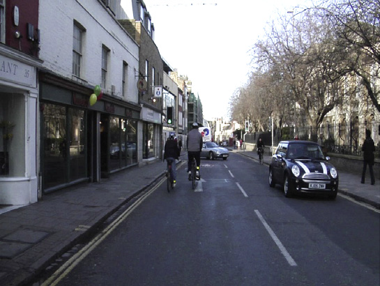

# Occupancy Grid Map From Monocular Camera Frame

This repository hosts MATLAB script for generating occupancy grid map from a monocular camera frame.

The monocular camera frame (first person view) is passed to a deep neural network trained to estimate free space around a vehicle
using semantic segmentation. Free space estimation identifies areas in the environment where the ego vehicle can drive without hitting
any obstacles such as pedestrians, curbs, or other vehicles. A vehicle can use a variety of sensors to estimate free space such as
RADAR, LiDAR, or cameras. This project focuses on estimating free space from a monocular camera using semantic segmentation and creating
an occupancy grid map using the same. This occupancy grid map can be used to create a vehicle costmap, which can be then used for 
path planning and navigation.

## Results
|              **Result**              |             **Image**                                                                |
| :----------------------------------: | :----------------------------------------------------------------------------------: |
| Test Frame                           |                                                         |
| First Person View (FPV)              |                            |
| Free Space Prediction [FPV]          | ![Free Space Prediction [FPV]](/Results/Free_Space_Prediction_FPV.png)               |
| Free Space Confidence Scores [FPV]   | ![Free Space Confidence Scores [FPV]](/Results/Free_Space_Confidence_Scores_FPV.png) |
| Bird's Eye View (BEV)                |                                |
| Free Space Confidence Scores [BEV]   | ![Free Space Confidence Scores [BEV]](/Results/Free_Space_Confidence_Scores_BEV.png) |
| Occupancy Grid Map                   |                                |
